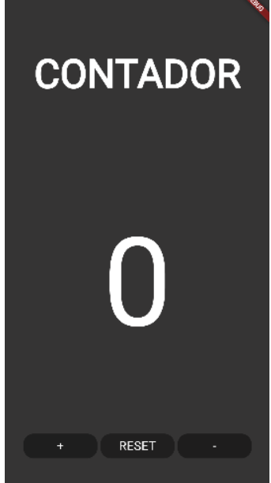
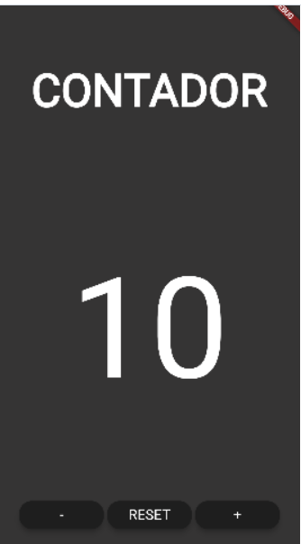

# Ejercicio 02

- Deberás de crear una clase en flutter que sea una plantilla de los botones, en la que le pases el argumento de texto y sustituirlo por los 3 botones que tenemos
- Darle funcionalidad a los botones, cambios solo por consola 
- Cambios por pantalla 

## Descripción del Proyecto

El proyecto consiste en una aplicación Flutter que muestra un contador en pantalla. La interfaz incluye un título "CONTADOR", un número que representa el contador y tres botones: "+" para incrementar, "RESET" para reiniciar y "-" para decrementar el contador.

# `btn_class.dart`

Este archivo define el widget `ButtonCount`, que es un botón personalizado utilizado en la pantalla del contador. Es un `StatelessWidget` con texto personalizable, tamaño de fuente y una devolución de llamada `onPressed`.

## Widget `Counter`

- Este es un `StatefulWidget` que representa la pantalla del contador.
- Tiene una clase de estado, `CounterState`, que gestiona el estado del contador.
- El contador se puede incrementar, decrementar o reiniciar mediante los botones proporcionados.

### Botones (`ButtonCount`)

- Widget de botón personalizado definido en `btn_class.dart`.
- Acepta parámetros como texto, tamaño de fuente y una devolución de llamada `onPressed`.
- Se utiliza para los botones de incremento, decremento y reinicio en el widget `Counter`.

